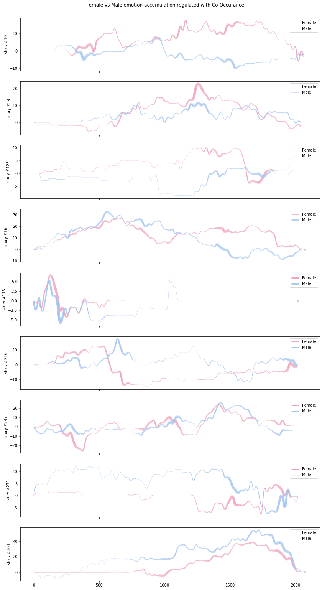
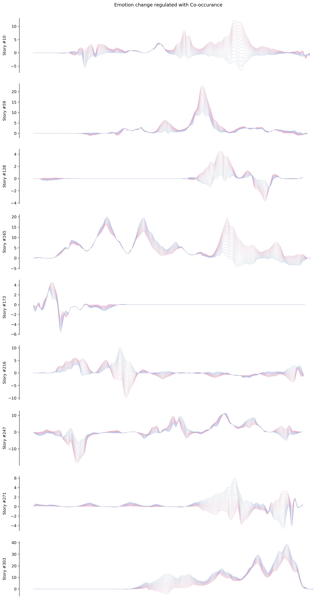
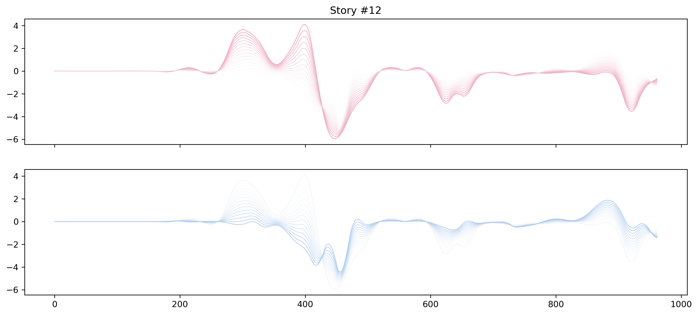
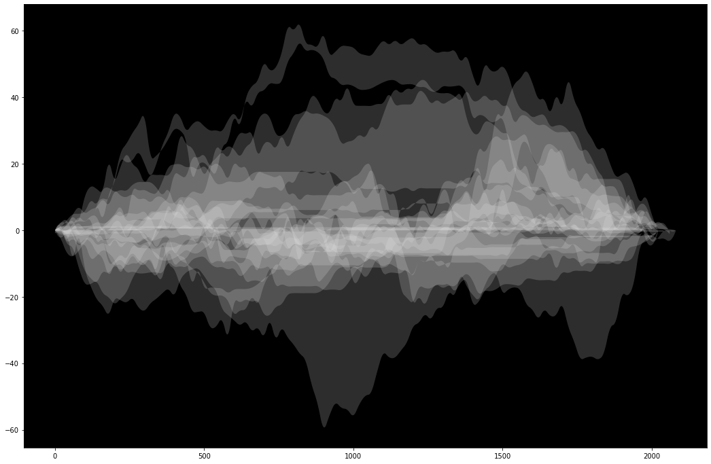
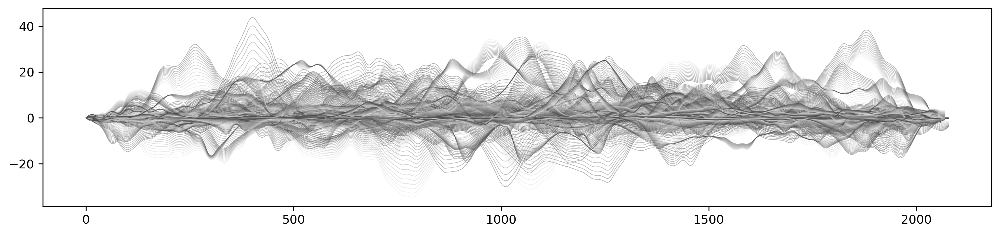
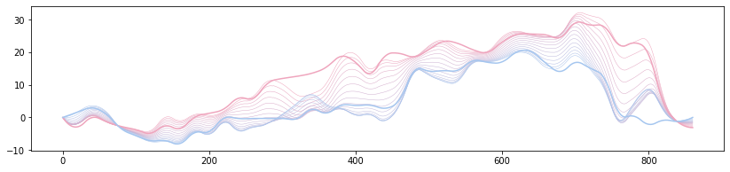
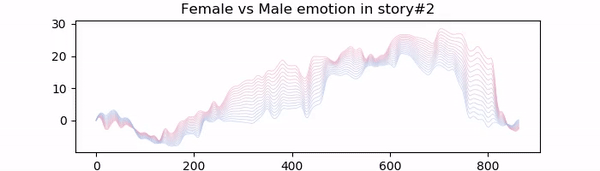

# Viz of Gender Stereotypes

Reveal gender stereotypes from word embedding by _Huimin_ et al. 

An effort in visualization the idea. 

## Usage

`$` `git clone --recurse-submodules https://github.com/wenoptics/viz-of-gender-stereotypes-from-texts`

And checkout [`general.ipynb`](./general.ipynb).

## Some explorations



x axis as n-th paragraph of the story, y axes as emotion accumulation. Wide line width as co-occurrences 
of the both genders characters. 

---



Thicker the line cluster means co-occurrence.

---

Separated gender plots:



## Some attempts on stacked views (_FAILED_)

16 stories stacked:



---
80 stories stacked:



## More attempts



Cluster filled with Perlin noise

---



[Animated](./animation.ipynb) demo

## Data & References

arXiv:[1811.04599](https://arxiv.org/abs/1811.04599) [cs.CL]

> ```
> @misc{xu2018cinderella,
>     title={The Cinderella Complex: Word Embeddings Reveal ender Stereotypes in Movies and Books},
>     author={Huimin Xu and Zhang Zhang and Lingfei Wu and Cheng-Jun Wang},
>     year={2018},
>     eprint={1811.04599},
>     archivePrefix={arXiv},
>     primaryClass={cs.CL}
> }
> ```
